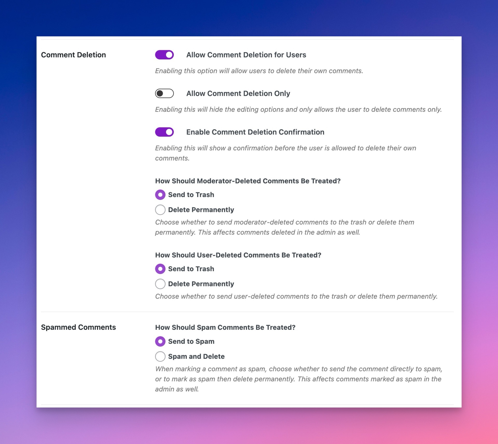

# How to Force Delete Comments

When you delete a comment, whether from the frontend or admin dashboard, it is moved to the trash.

However, there's a way through code to force delete a comment anytime it's deleted.

### Force Deleting Comments Through Code

You'd place the following in a [mu-plugin](https://dlxplugins.com/tutorials/what-are-mu-plugins-and-how-do-you-create-them/) or code snippet.

```php
<?php
/**
 * Maybe delete a comment permanently if admin setting is on.
 *
 * @param int        $comment_id The comment ID.
 * @param WP_Comment $comment    The comment object.
 */
function dlx_maybe_force_delete_comment( $comment, $comment_id ) {
	wp_delete_comment( $comment_id, true );
	return $comment;
}
add_filter( 'trashed_comment', 'dlx_maybe_force_delete_comment', 10, 2 );
```

### Force Deleting Spam Comment

To force delete comments marked as spam, you'd modify the above for the `spammed_comment` filter.

```php
<?php
/**
 * Maybe delete a comment permanently if admin setting is on.
 *
 * @param int        $comment_id The comment ID.
 * @param WP_Comment $comment    The comment object.
 */
function dlx_maybe_force_delete_comment( $comment, $comment_id ) {
	wp_delete_comment( $comment_id, true );
	return $comment;
}
add_filter( 'trashed_comment', 'dlx_maybe_force_delete_comment', 10, 2 );
add_filter( 'spammed_comment', 'dlx_maybe_force_delete_comment', 10, 2 );
```

### Force Deleting Edited Comments

If comment deletion is enabled in Comment Edit Core, you can force delete a comment by adding the following:

```php
add_filter( 'sce_force_delete', '__return_true' );
```

### Force Deletion Without Code

[Comment Edit Pro](https://dlxplugins.com/plugins/comment-edit-pro/), a premium plugin that compliments Comment Edit Core, has options for force deletion.

<figure><figcaption><p>Comment Edit Pro Deletion Options</p></figcaption></figure>


Visit Comment Edit Pro



