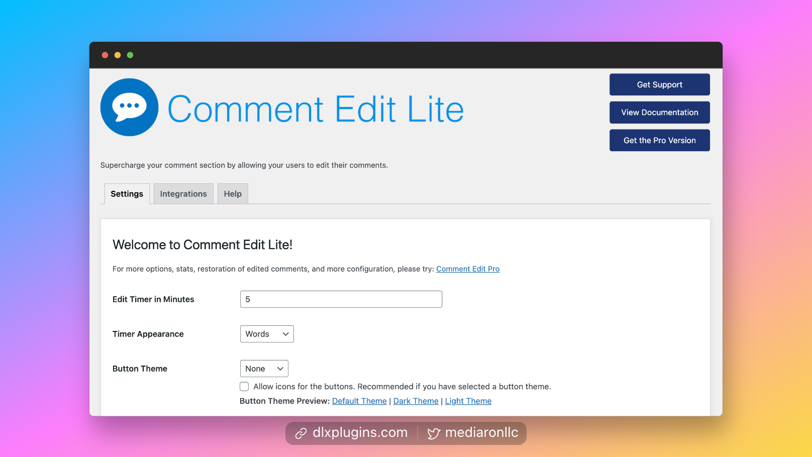
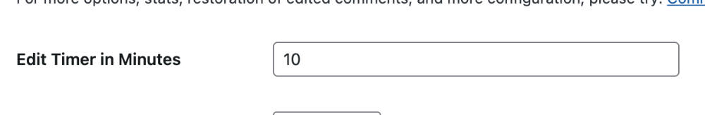
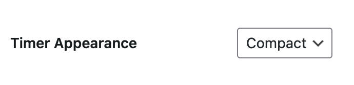
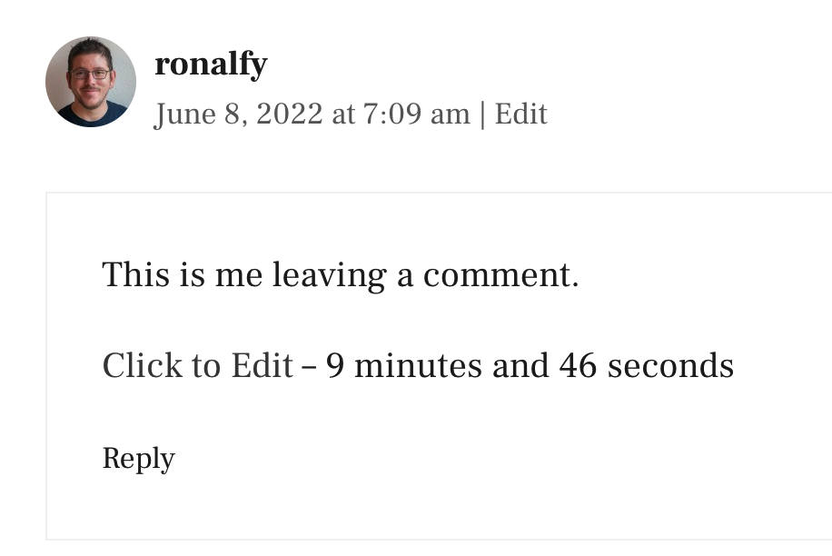
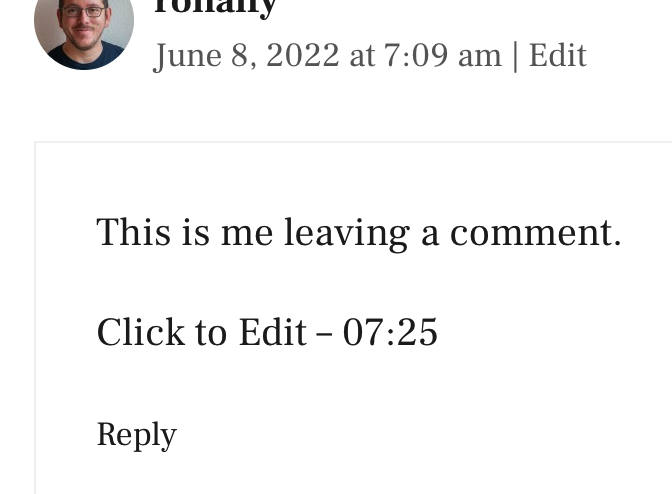
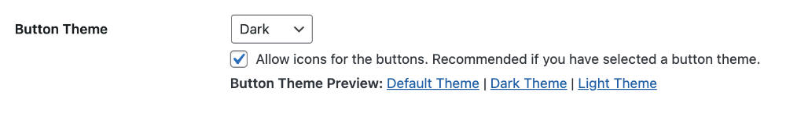
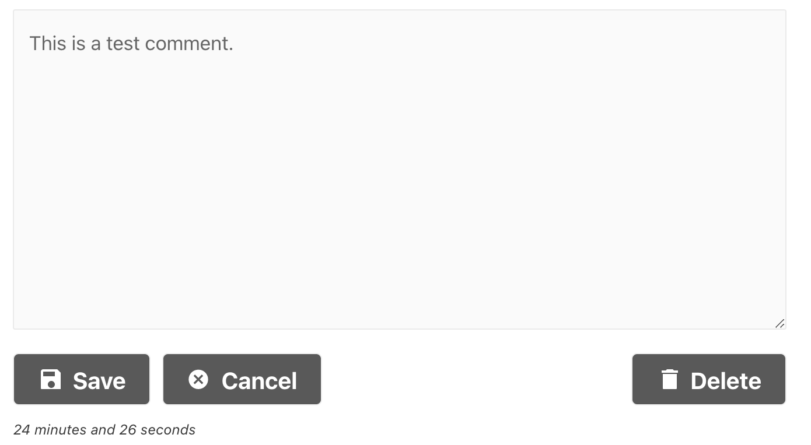
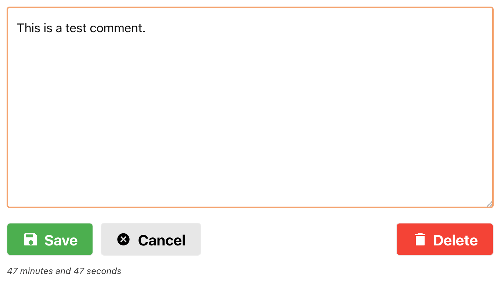
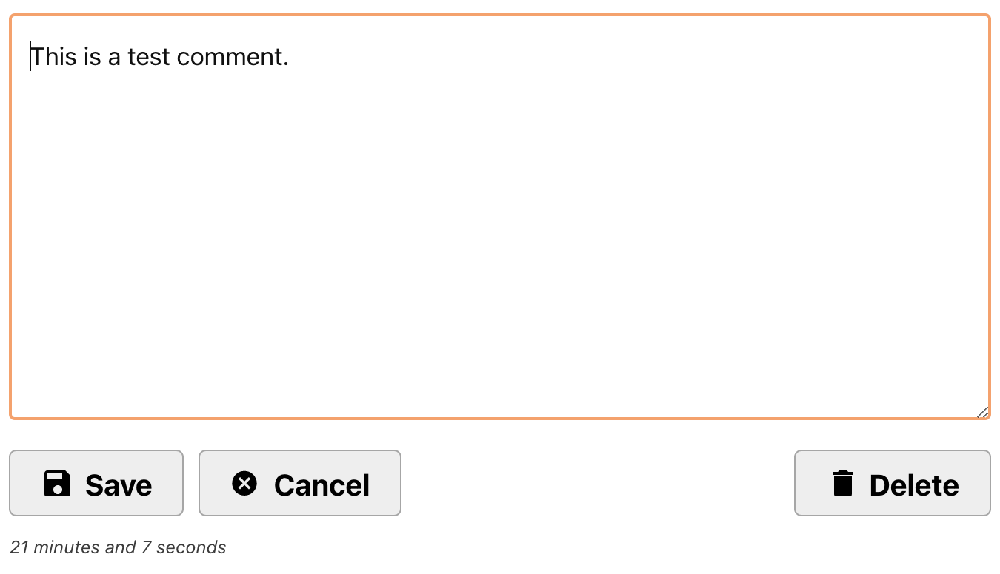

# Configuration

<figure><figcaption>
Comment Edit Lite admin panel
</figcaption></figure>

## Configuration Options

Comment Edit Lite (formerly Simple Comment Editing) is famous for its zero-configuration setup. By default, users can edit comments for 5 minutes with no need to set any admin settings.

Comment Edit Lite does have some base options, which we'll go over below.

### Adjusting the Comment Timer

The default edit time is 5 minutes. You can adjust this to what you are comfortable with.

Please note that unlimited comment editing for logged-in users is possible with [Comment Edit Pro](https://dlxplugins.com/plugins/comment-edit-pro/).


**Avoid Long Timers**: Comment Editing is cookie-based and should expire in a reasonable timeframe to avoid inadvertent edits and/or modified replies.


### Adjusting the Timer Appearance

By default, Simple Comment Editing will output the timer using words.

If you would like to have a compact timer, you can select `Compact` from the dropdown.

### Adjusting the Theme

By default, Simple Comment Editing has no styles so it can be compatible with most themes.

There are three themes included if you'd like to change up the appearance:

* Default theme
* Dark theme
* Light theme

  


**Need more fine-tuning?** Please check out [Comment Edit Pro](https://dlxplugins.com/plugins/comment-edit-pro/).

