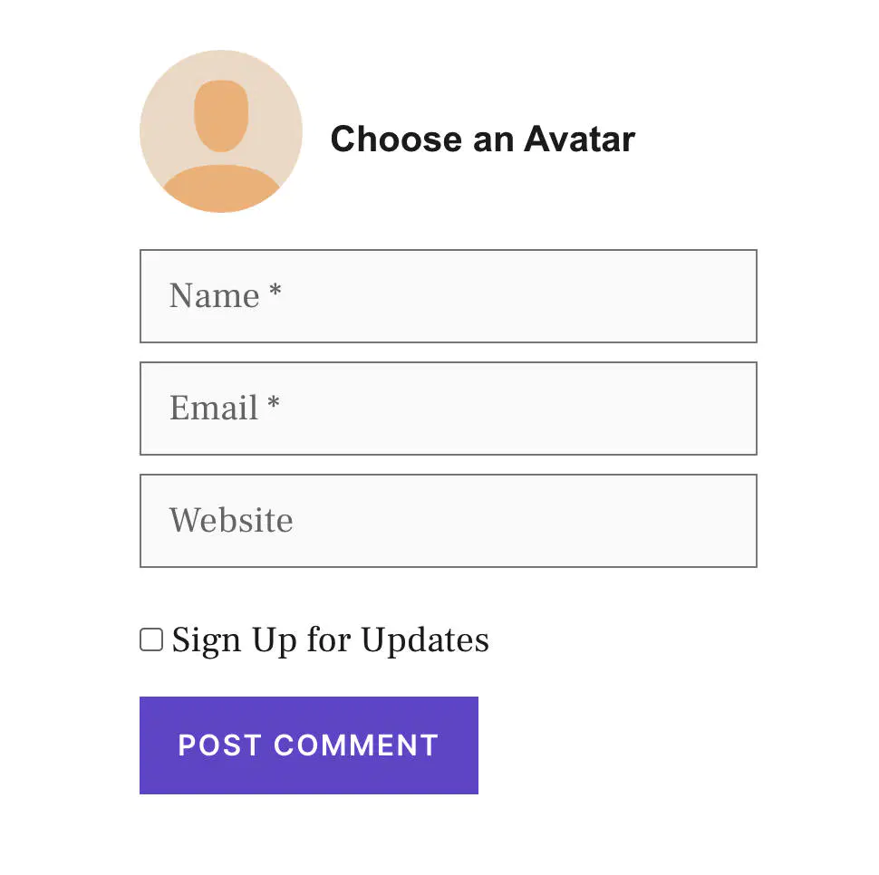
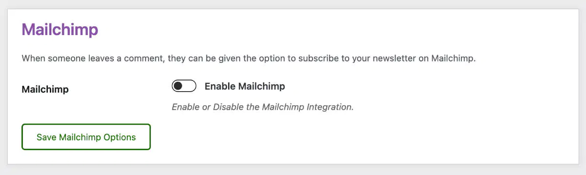
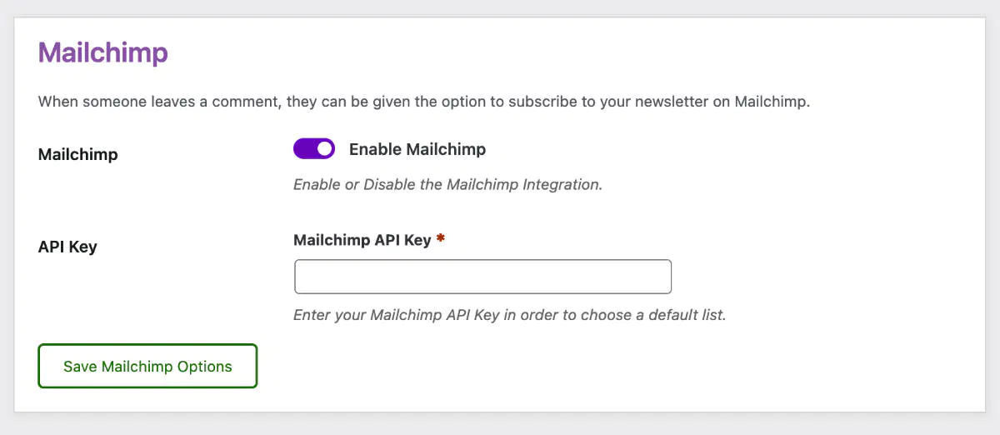
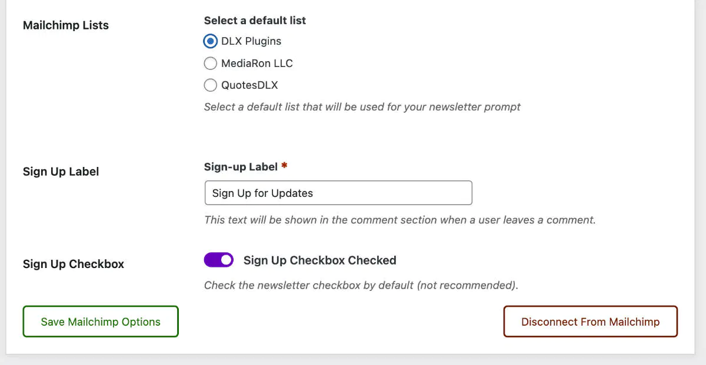
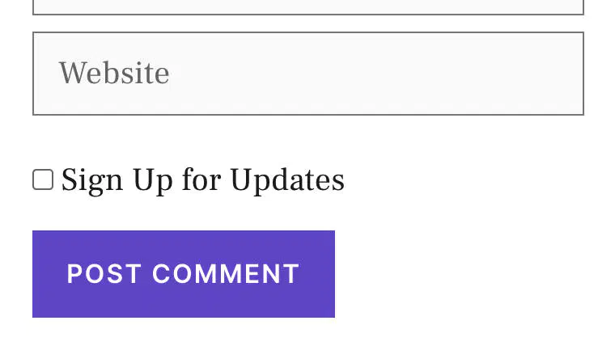

# Mailchimp Integration

## Why Mailchimp?

Mailchimp is by far the [largest provider for newsletters](https://www.emailtooltester.com/en/blog/mailchimp-market-share/). Adding Mailchimp to your comment section is a no-brainer and is an easy way to get more subscribers through comments.

## Mailchimp on the Front-end

With Mailchimp enabled in Comment Edit Lite, you'll see a checkbox just above the submit button.

<figure><figcaption>
Customizable Signup Text in the Comment Section
</figcaption></figure>

## Enabling Mailchimp

<figure><figcaption>
Enable Mailchimp Toggle Switch
</figcaption></figure>

You'll find Mailchimp in the **Integrations** tab in Comment Edit Pro. If you're setting it up for the first time, you'll see an enable toggle switch.

## Setting the Mailchimp API Key

Once Mailchimp is enabled, you can enter your Mailchimp API key.

<figure><figcaption>
Entering your Mailchimp API Key
</figcaption></figure>


**Mailchimp API Key**: Please view the [Mailchimp documentation](https://mailchimp.com/help/about-api-keys/) on retrieving your API key.



Documentation for Retrieving the Mailchimp API Key


## Selecting a List

Once you have entered your API key, you will need to save the options so that you can select a list.

## Configuring Mailchimp Options

Once a list is selected, you can configure and save the options.

<figure><figcaption></figcaption></figure>

You can customize:

* **The sign-up label**: this will show above the comment submit button.
* **The checked state**: you can check or uncheck the sign-up option.


**Checked by default**: having the box checked may affect spam protection in some countries.


## Mailchimp in the Comment Section

With Mailchimp set up, you will now see a checkbox above the submit button for subscribing to a list.

<figure><figcaption>
Mailchimp Signup Label
</figcaption></figure>

## Future Plans for Mailchimp

If this feature proves popular and users request it, there is a plan to allow a Mailchimp list per post setting.
